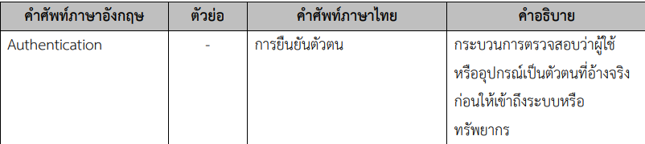
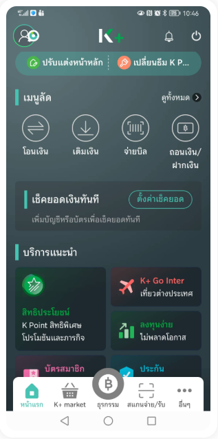
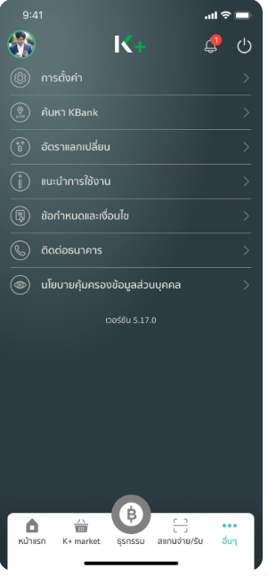
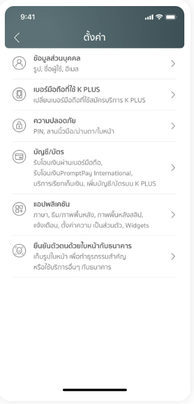
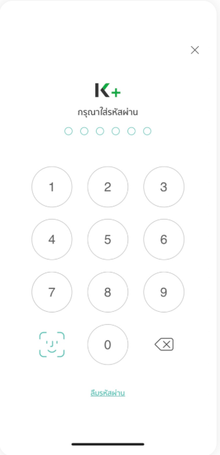
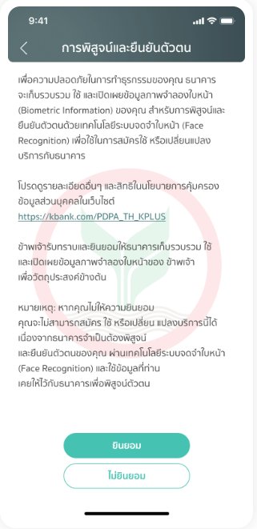
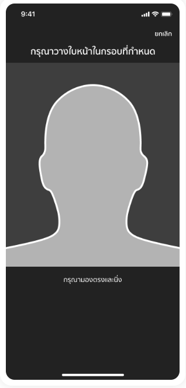

หลักการ Authentication

Authentication คือ กระบวนการตรวจสอบและยืนยันตัวตนของผู้ใช้งานก่อนเข้าใช้งานระบบสารสนเทศ เพื่อให้มั่นใจว่าผู้ที่กำลังเข้าสู่ระบบเป็นบุคคลที่ถูกต้องตามที่อ้างสิทธิ์ไว้ ถือเป็นขั้นตอนสำคัญด้านความมั่นคงปลอดภัยของข้อมูล 
(Information Security) (หน้า 141)

## การยืนยันตัวตนผ่านแอปพลิเคชัน K plus

1.เข้าสู่ K PLUS เลือก “อื่น”

2.เลือก “การตั้งค่า”

3.เลือก “ยืนยันตัวตนด้วยใบหน้ากับธนาคาร”

4.ใส่รหัสผ่านเพื่อเข้าสู่ระบบ

5.กด “ยินยอม” เพื่ออนุญาตให้ธนาคารใช้ข้อมูลใบหน้าเพื่อทำรายการ

6.สแกนใบหน้า

7.ลงทะเบียนใบหน้าสำเร็จ* กรณีที่คุณยังไม่เคยยืนยันกับธนาคาร คุณสามารถนำบัตรประชาชนไปยืนยันตัวตนที่ตู้ K-ATM หรือตู้ที่มีสัญลักษณ์ K CHECK ID ได้

