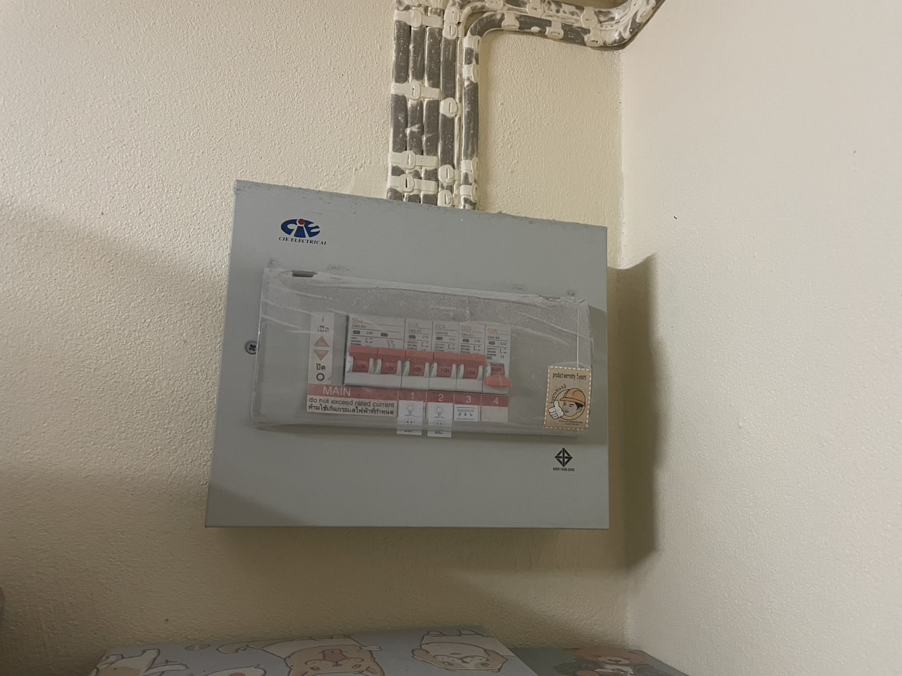

ระบบเครื่องตัดกระแสไฟรั่ว (Breaker)

ระบบเครื่องตัดกระแสไฟรั่ว (RCD/ELCB) เป็น Technical Security Control ที่มีลักษณะเป็น Preventive Control

เหตุผลคือ…

1.ช่วยตัดกระแสไฟทันทีเมื่อเริ่มเกิดไฟฟ้ารั่ว
    เนื่องจากเมื่อมีกระแสไฟฟ้ารั่วไหลออกจากวงจร
    เครื่องตัดไฟรั่วจะตรวจจับความผิดปกติและทำการตัดวงจรไฟฟ้าโดยอัตโนมัติ
    เพื่อป้องกันไม่ให้เกิดอันตรายที่รุนแรงขึ้น
    
2.ป้องกันความเสียหายจากความผิดปกติของระบบไฟฟ้า
    เพราะเมื่อเกิดเหตุการณ์ เช่น สายไฟชำรุด หรืออุปกรณ์ไฟฟ้าทำงานผิดปกติ
    เครื่องตัดไฟรั่วจะทำหน้าที่หยุดการจ่ายกระแสไฟทันที
    เป็นการยับยั้งเหตุอันตรายก่อนที่จะส่งผลกระทบต่อผู้ใช้งาน
    
3.ลดความเสี่ยงต่อชีวิตและทรัพย์สิน
    เนื่องจากการตัดกระแสไฟอย่างรวดเร็ว
    ช่วยป้องกันอันตรายจากไฟฟ้าดูด ไฟฟ้าลัดวงจร และการเกิดเพลิงไหม้
    จึงถือเป็นมาตรการเชิงป้องกันความเสียหายล่วงหน้า
    
4.รักษาระบบไฟฟ้าให้อยู่ในสภาวะปลอดภัย
    เพราะการตัดไฟอัตโนมัติทำให้ระบบหยุดทำงานทันทีเมื่อพบความผิดปกติ
    ผู้ใช้งานสามารถตรวจสอบและแก้ไขสาเหตุได้ก่อนเปิดใช้งานอีกครั้ง
    ส่งผลให้ระบบกลับมาใช้งานได้อย่างปลอดภัย

