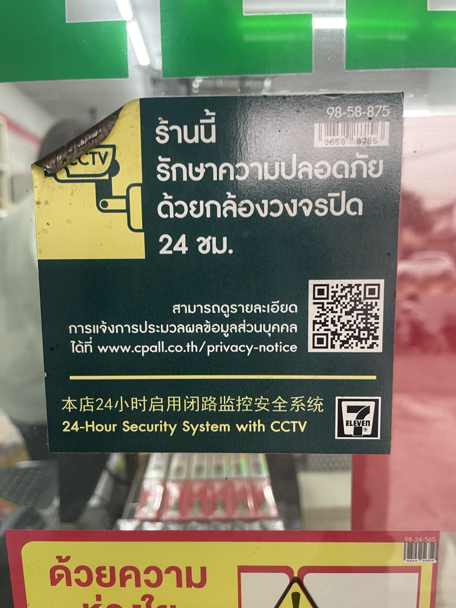

PDPA คืออะไร (อธิบายแบบเข้าใจง่าย)

PDPA คือกฎหมายที่คุ้มครองข้อมูลส่วนบุคคลของประชาชน เช่น ชื่อ เบอร์โทร รูปถ่าย ใบหน้า เสียง หรือพฤติกรรมต่าง ๆ เพื่อไม่ให้นำข้อมูลไปใช้โดยไม่ได้รับอนุญาต

ความเกี่ยวข้องของ PDPA กับป้ายกล้องวงจรปิดในภาพ

ซึ่ง ภาพจากกล้องวงจรปิดถือเป็นข้อมูลส่วนบุคคล เพราะสามารถระบุตัวบุคคลได้ ร้านค้าจึงต้องปฏิบัติตาม PDPA ดังนี้

1. ต้องแจ้งให้ทราบล่วงหน้า

  -ร้านต้องติดป้ายแจ้งให้ลูกค้ารู้ว่า
  
  -มีการบันทึกภาพ
  
ใช้ข้อมูลเพื่อความปลอดภัย
ซึ่งในภาพมีการแจ้งชัดเจน ✔️

2. ระบุวัตถุประสงค์ในการเก็บข้อมูล

  - ในป้ายระบุว่าใช้เพื่อ
     
“รักษาความปลอดภัย”
ไม่ใช่นำไปใช้เพื่อวัตถุประสงค์อื่น เช่น โฆษณา ✔️

3. มีช่องทางให้ศึกษารายละเอียดเพิ่มเติม
  - ในภาพมี
     
  - เว็บไซต์ Privacy Notice
QR Code
เพื่อให้ผู้ใช้บริการตรวจสอบสิทธิของตนเองได้ ✔️

4. ต้องไม่ละเมิดสิทธิของเจ้าของข้อมูล

  -ร้านต้อง
  
  -ไม่เผยแพร่ภาพโดยไม่จำเป็น
  
  -เก็บข้อมูลอย่างปลอดภัย
  
  -ลบข้อมูลเมื่อหมดความจำเป็น
