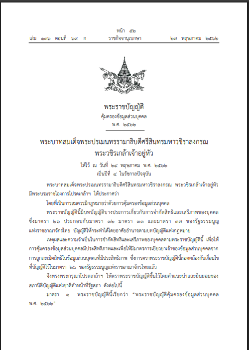
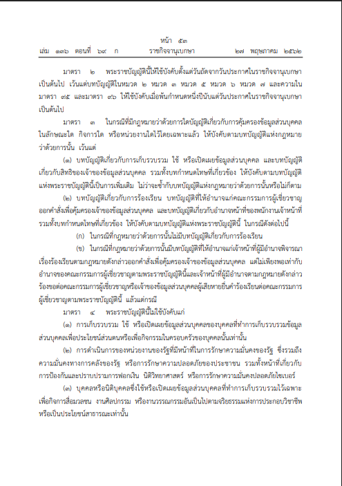

พระราชบัญญัติคุ้มครองข้อมูลส่วนบุคคล (PDPA) การรถไฟแห่งประเทศไทย

    ภาพรวมของแนวนโยบาย

    เอกสารนี้อธิบาย หลักการคุ้มครองข้อมูลส่วนบุคคล และ ข้อยกเว้นในการใช้กฎหมาย PDPA ว่า

    กรณีใด “ต้องปฏิบัติตาม PDPA”

    กรณีใด “ไม่ต้องปฏิบัติตาม PDPA”

    เป้าหมายหลักคือ
    👉 ปกป้องสิทธิ ความเป็นส่วนตัว และความปลอดภัยของข้อมูลส่วนบุคคลของประชาชน

