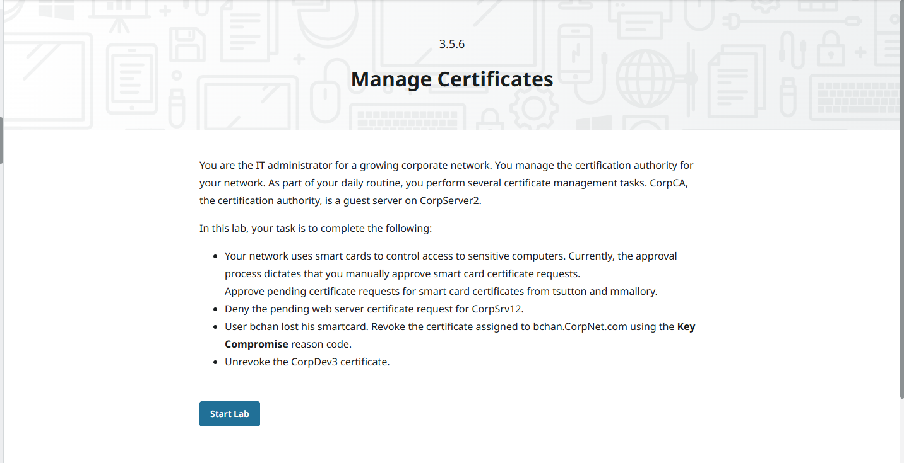

1.อนุมัติ (Approve) คำขอใบรับรอง Smart Card

    -สำหรับผู้ใช้ tsutton และ mmallory

2.ปฏิเสธ (Deny) คำขอใบรับรอง Web Server

    -สำหรับเครื่อง CorpSrv12

3.เพิกถอนใบรับรอง (Revoke Certificate) ของผู้ใช้ bchan

    -เพราะทำ Smart Card หาย

    -เลือกเหตุผลการเพิกถอนเป็น Key Compromise

4.ยกเลิกการเพิกถอน (Unrevoke) ใบรับรองของ CorpDev3

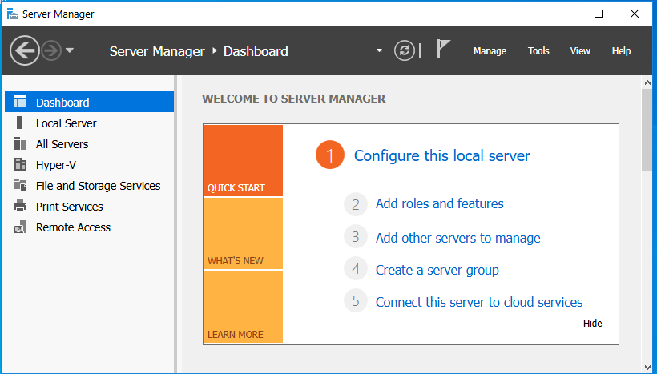

1.เปิด Server Manager

2.ที่หน้า Dashboard จะมีงานเริ่มต้นให้ทำ ได้แก่

    -Configure this local server → ตั้งค่าเซิร์ฟเวอร์

    -Add roles and features → ติดตั้ง Roles / Services

    -Add other servers to manage → เพิ่มเครื่องอื่นให้จัดการ

    -Create a server group → จัดกลุ่มเซิร์ฟเวอร์

    -Connect this server to cloud services → เชื่อมต่อบริการคลาวด์

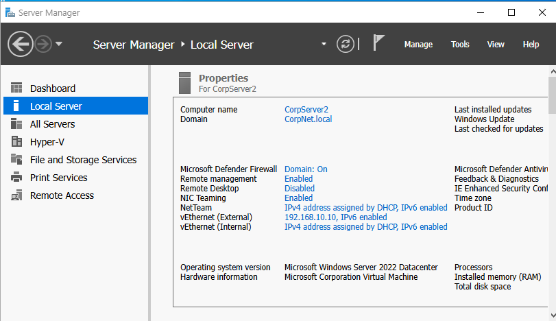

ขั้นตอนสั้น ๆ ที่เกี่ยวข้องกับหน้านี้คือ

1.คลิกเมนู Local Server บนแถบซ้าย

2.หน้านี้จะแสดงข้อมูลสำคัญของเซิร์ฟเวอร์ เช่น

    -ชื่อเครื่อง (CorpServer2)

    -โดเมนที่เข้าร่วม (CorpNet.local)

    -สถานะ Firewall / Remote Management

    -IPv4 / IPv6

    -ระบบปฏิบัติการและฮาร์ดแวร์

3.สามารถคลิกลิงก์แต่ละรายการเพื่อแก้ไขค่าการตั้งค่าได้

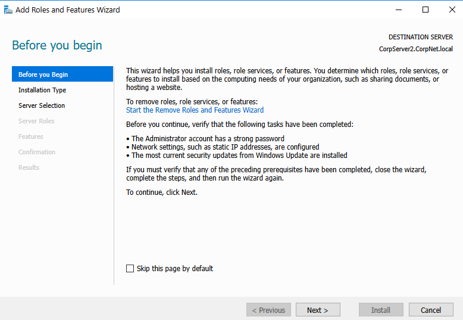

ขั้นตอนสั้น ๆ คือ

1.เปิดตัวช่วยติดตั้ง Roles / Features บน Windows Server

2.หน้านี้เป็นหน้าแนะนำก่อนเริ่มติดตั้ง แจ้งว่า

    -บัญชี Administrator ต้องตั้งรหัสผ่าน

    -การตั้งค่าเครือข่ายต้องถูกต้อง

    -ควรอัปเดต Windows ให้เป็นเวอร์ชันล่าสุด

3.เมื่อพร้อมแล้ว ให้กด Next เพื่อไปขั้นตอนถัดไป

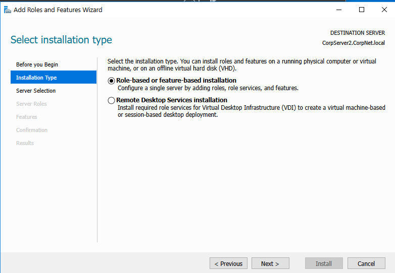

คำอธิบายขั้นตอนแบบสั้น ๆ:

1.เลือกประเภทการติดตั้ง

ตัวเลือกที่เลือกอยู่คือ

    ✅ Role-based or feature-based installation
    (ใช้สำหรับติดตั้ง Roles หรือ Features บนเครื่องเซิร์ฟเวอร์นี้)

2.อีกตัวเลือกคือ

    ⭕ Remote Desktop Services installation
    (ใช้เมื่อต้องติดตั้งระบบ Remote Desktop VDI — ซึ่งไม่ใช้ในงานนี้)

3.หลังเลือกแล้วให้กด Next เพื่อไปขั้นตอนถัดไป

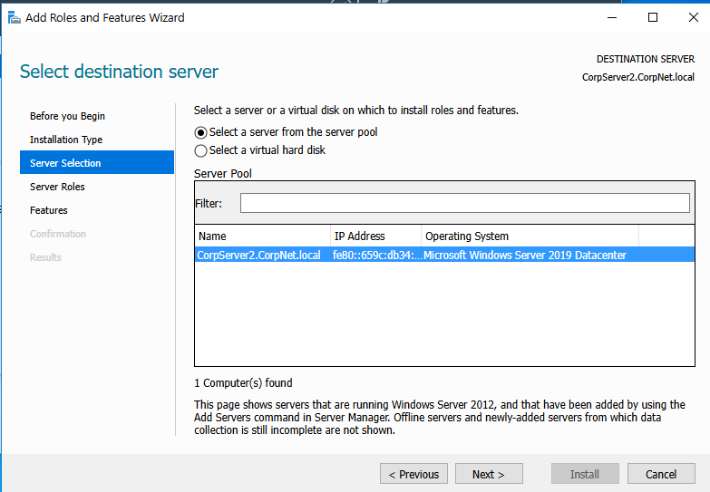

ขั้นตอนการติดตั้ง Role หรือ Feature ของ Windows Server สรุปขั้นตอนสั้นๆ ได้ดังนี้

1.เลือกรูปแบบการติดตั้ง: ติ๊กเลือก "Select a server from the server pool" 

เพื่อระบุว่าจะติดตั้งลงบนเครื่องเซิร์ฟเวอร์โดยตรง (ไม่ใช่ไฟล์ Hard Disk เสมือน)

2.เลือกเซิร์ฟเวอร์เป้าหมาย: คลิกเลือกชื่อเซิร์ฟเวอร์จากรายการในช่อง Server Pool 

(ในภาพคือเครื่อง CorpServer2.CorpNet.local)

3.ไปต่อ: เมื่อเลือกเครื่องเสร็จแล้ว ให้กดปุ่ม Next เพื่อไปเลือก Role หรือ Feature ที่ต้องการติดตั้งในหน้าถัดไป

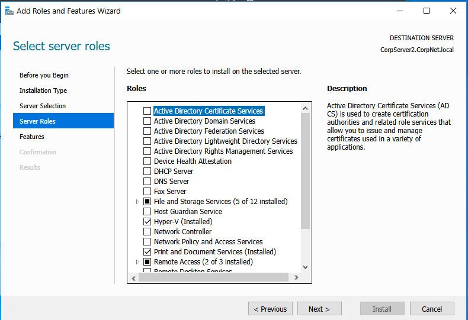

สรุปสั้นๆ ดังนี้

1.เลือกบทบาท (Roles): ติ๊กถูกหน้าชื่อบริการที่ต้องการติดตั้งลงในเซิร์ฟเวอร์ 

(เช่น DNS Server, DHCP Server หรือ Web Server)

2.ตรวจสอบสถานะ: สังเกตในรายการจะเห็นบางรายการขึ้นว่า (Installed) หมายถึงติดตั้งไปแล้ว หรือบางรายการมีแถบสีดำ 

(เช่น File and Storage Services) หมายถึงมีการติดตั้งบางส่วนไว้แล้ว

3.ดูรายละเอียด: เมื่อคลิกที่ชื่อ Role ด้านขวาจะแสดงคำอธิบาย (Description) ว่าหน้าที่นั้นใช้ทำอะไร

4.ไปต่อ: เมื่อเลือก Role ที่ต้องการครบแล้ว ให้กดปุ่ม Next เพื่อไปตั้งค่า Feature ในหน้าถัดไป

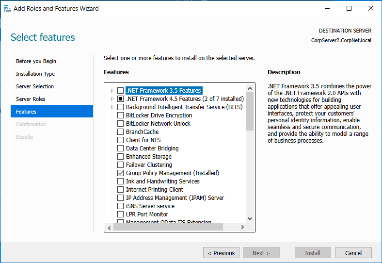

ภาพทั้งสองแสดงขั้นตอนต่อเนื่องในการปรับแต่งความสามารถของ Windows Server ผ่าน Add Roles and Features Wizard 

สรุปสั้นๆ ได้ดังนี้

1.ภาพ Select server roles (LAB7.png)

ขั้นตอนนี้คือการเลือก "หน้าที่หลัก" (Roles) ให้กับเซิร์ฟเวอร์

    เลือกบทบาท: ติ๊กเลือกบริการหลักที่ต้องการ เช่น DNS Server หรือ DHCP Server

    สถานะการติดตั้ง: รายการที่มีเครื่องหมายถูกและระบุว่า (Installed) คือติดตั้งไปแล้ว เช่น Hyper-V และ 
    
    Print and Document Services

2.ภาพ Select features (LAB8.png)

ขั้นตอนนี้คือการเลือก "เครื่องมือเสริม" (Features) เพื่อสนับสนุนการทำงานของ Roles หรือตัวระบบปฏิบัติการเอง

    เลือกฟีเจอร์: ติ๊กเลือกโปรแกรมเสริมหรือความสามารถเฉพาะทาง เช่น .NET Framework หรือ BitLocker

    สถานะปัจจุบัน: ในภาพมีการติดตั้ง Group Policy Management ไว้เรียบร้อยแล้ว

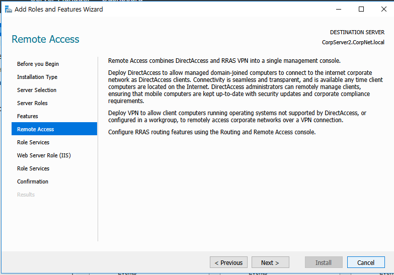

ภาพเหล่านี้แสดงขั้นตอนการกำหนดค่าในหน้าต่าง Add Roles and Features Wizard ของ Windows Server สรุปสั้นๆ ดังนี้

1. เลือกบทบาท (Select server roles - LAB7.png)

       เป็นขั้นตอนการเลือก "หน้าที่หลัก" ให้กับเซิร์ฟเวอร์

       ในภาพมีการติดตั้งบทบาท Hyper-V และ Print and Document Services ไว้แล้ว

       บทบาท Remote Access และ File and Storage Services มีการติดตั้งไว้แล้วบางส่วน

2.เลือกคุณสมบัติเสริม (Select features - LAB8.png)

    เป็นการเลือก "ความสามารถเสริม" เพื่อสนับสนุนการทำงานของระบบ

    ในภาพมีการติดตั้ง Group Policy Management ไว้เรียบร้อยแล้ว

    มีการติดตั้งคุณสมบัติบางส่วนของ .NET Framework 4.5 ไว้แล้ว (2 จาก 7 รายการ)

3. ข้อมูล Remote Access (LAB9.png)

       -เป็นหน้าแสดงรายละเอียดของบทบาท Remote Access ที่ถูกเลือกไว้

       -อธิบายว่าบริการนี้รวม DirectAccess และ VPN เข้าด้วยกัน เพื่อให้เครื่องลูกข่ายเชื่อมต่อเข้าเครือข่ายองค์กรได้จากระยะไกล

       -ให้กดปุ่ม Next เพื่อเข้าไปเลือก Role Services เฉพาะเจาะจงในหน้าถัดไป

สรุปขั้นตอนจากภาพทั้งหมดในการตั้งค่า Remote Access บน Windows Server สั้นๆ ดังนี้

1. เลือกบทบาทและคุณสมบัติ (LAB7 & LAB8)

        Select server roles: เลือกบทบาทหลักที่จะติดตั้ง ในที่นี้คือ Remote Access (ซึ่งในภาพมีการเลือกไว้แล้วบางส่วน)

        Select features: เลือกคุณสมบัติเสริมเพื่อสนับสนุนระบบ (เช่น Group Policy Management ที่ติดตั้งไว้แล้ว)
   
2. เข้าสู่การตั้งค่า Remote Access (LAB9 & LAB10)

        Remote Access (Intro): หน้าอธิบายความสามารถของบริการ ซึ่งรวม DirectAccess (เชื่อมต่ออัตโนมัติ) และ VPN (เชื่อมต่อผ่านอุโมงค์ข้อมูล) เข้าด้วยกัน

        Select role services: เลือกบริการย่อยภายใน Remote Access โดยในภาพเลือกติ๊กที่ DirectAccess and VPN (RAS)

        เพื่อเปิดใช้งานการเชื่อมต่อจากระยะไกลสำหรับเครื่อง Client

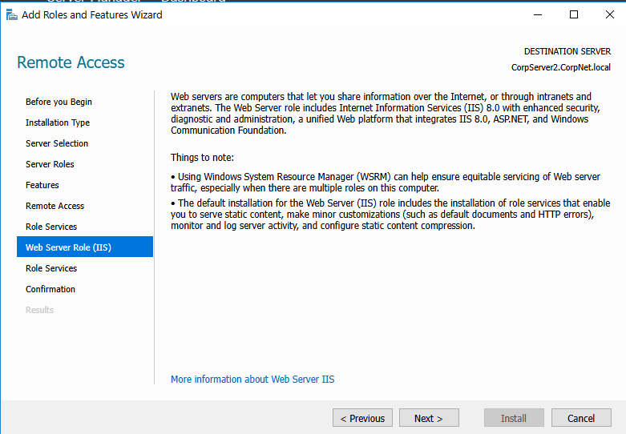

ภาพเหล่านี้แสดงลำดับขั้นตอนการติดตั้งและตั้งค่าบริการ Remote Access และ Web Server บน Windows Server สรุปสั้นๆ ดังนี้

1.เลือกบทบาทหลัก (LAB7): เลือกติดตั้งบทบาท Remote Access และ Web Server (IIS) 

เพื่อเปิดใช้งานบริการจัดการการเชื่อมต่อและเว็บเซิร์ฟเวอร์

2.เลือกคุณสมบัติเสริม (LAB8): เลือก Features เพิ่มเติมที่จำเป็น เช่น Group Policy Management 

เพื่อใช้ควบคุมนโยบายของระบบ

3.ตั้งค่า Remote Access (LAB9 & LAB10):

    ดูรายละเอียดของบริการซึ่งรวมถึง DirectAccess และ VPN เข้าด้วยกัน

    ในหน้า Role Services ให้ติ๊กเลือก DirectAccess and VPN (RAS) เพื่ออนุญาตให้เครื่อง Client เชื่อมต่อเครือข่ายองค์กรผ่านอินเทอร์เน็ตได้

4.ตั้งค่า Web Server (IIS) (LAB11): เข้าสู่หน้าข้อมูลเบื้องต้นของ Web Server (IIS) ซึ่งอธิบายเกี่ยวกับ

การแชร์ข้อมูลผ่านอินเทอร์เน็ตและการรองรับ ASP.NET ก่อนจะไปเลือกบริการย่อยในหน้าถัดไป

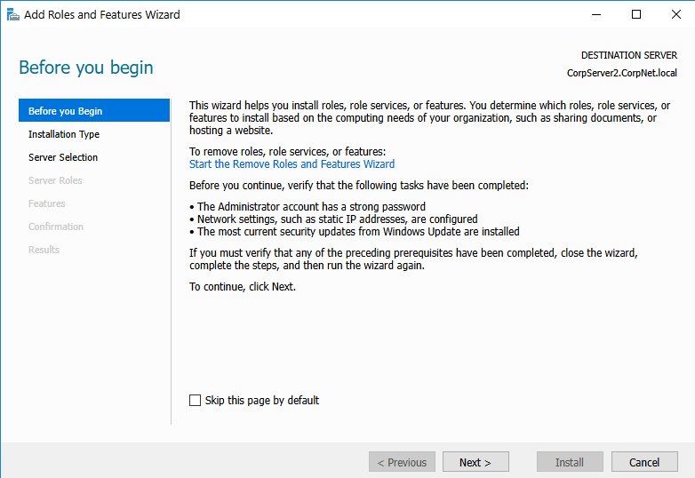

1. เริ่มต้นและเลือกบทบาท/คุณสมบัติ (LAB12, LAB7, LAB8)

        Before you begin: หน้าตรวจสอบความพร้อม เช่น รหัสผ่าน Administrator และการตั้งค่า IP Address

        Select server roles: เลือกหน้าที่หลักให้เซิร์ฟเวอร์ ในภาพมีการติดตั้ง Hyper-V และ Print and Document Services ไว้แล้ว

        Select features: เลือกความสามารถเสริม เช่น Group Policy Management ที่ติดตั้งไว้แล้ว

2. ตั้งค่า Remote Access (LAB9, LAB10)

        Remote Access Intro: อธิบายการทำงานของ DirectAccess และ VPN เพื่อการเชื่อมต่อจากภายนอก

        Select role services: เลือกบริการย่อย โดยในภาพเลือก DirectAccess and VPN (RAS) เพื่อเปิดใช้การเข้าถึงเครือข่ายระยะไกล

3. ตั้งค่า Web Server (IIS) (LAB11)

        Web Server Role (IIS): หน้าอธิบายหน้าที่ของเว็บเซิร์ฟเวอร์ในการแชร์ข้อมูล และการรองรับ ASP.NET

        เพื่อเตรียมพร้อมสำหรับการตั้งค่าบริการย่อยของเว็บในขั้นตอนถัดไป

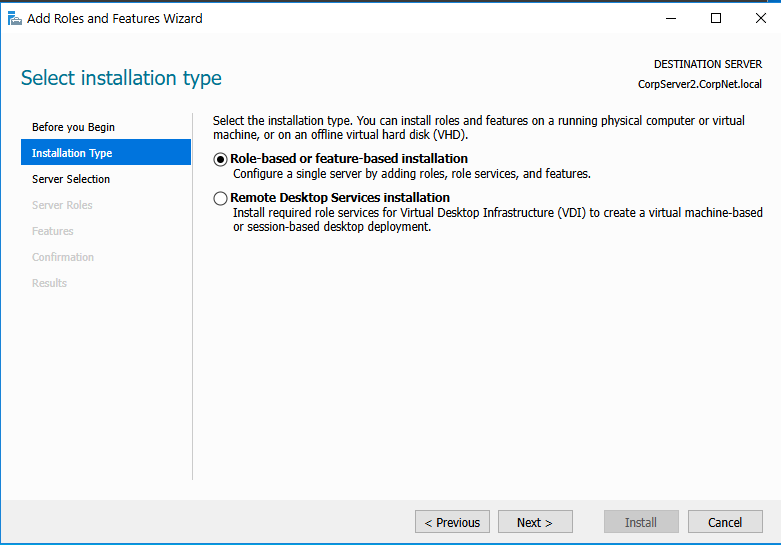

ภาพเหล่านี้แสดงขั้นตอนการเตรียมการและเลือกรูปแบบการติดตั้งใน Add Roles and Features Wizard สรุปสั้นๆ ดังนี้

1.การเตรียมความพร้อมและเลือกรูปแบบ (LAB12 & LAB13)

    Before you begin: หน้าตรวจสอบเงื่อนไขก่อนเริ่ม เช่น บัญชี Admin ต้องมีรหัสผ่านที่คาดเดายาก
    
    ตั้งค่า IP Address แบบ Static และอัปเดตระบบให้เป็นปัจจุบันแล้ว

    Select installation type: เลือกรูปแบบการติดตั้ง โดยในภาพเลือก Role-based or feature-based installation 
    
    เพื่อติดตั้งบริการลงบนเครื่องเซิร์ฟเวอร์เดียว

2. การเลือกบริการหลักและส่วนเสริม (LAB7 & LAB8)

       Select server roles: เลือกหน้าที่หลักให้เซิร์ฟเวอร์ (เช่น Hyper-V หรือ Print Services)

       Select features: เลือกความสามารถเสริมเพื่อสนับสนุนระบบ (เช่น Group Policy Management หรือ .NET Framework)

3. การกำหนดค่าบริการเฉพาะทาง (LAB9, LAB10, LAB11)

       Remote Access: ตั้งค่าบริการเชื่อมต่อจากระยะไกล โดยเลือก DirectAccess and VPN (RAS) เพื่อให้ผู้ใช้เข้าถึงเครือข่ายภายในผ่านอินเทอร์เน็ตได้

       Web Server (IIS): หน้าเริ่มต้นสำหรับการตั้งค่าเซิร์ฟเวอร์ให้รองรับการรันเว็บไซต์และแอปพลิเคชัน

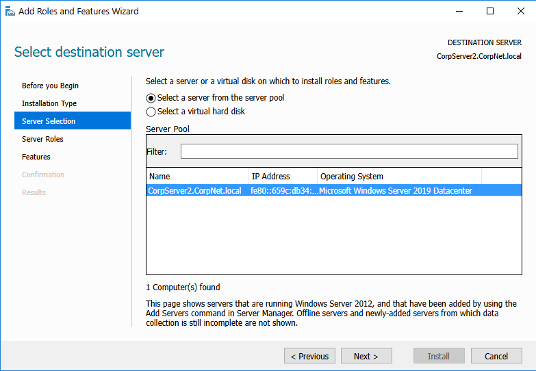

ภาพเหล่านี้แสดงขั้นตอนการกำหนดค่าในหน้าต่าง Add Roles and Features Wizard เพื่อเตรียมพร้อมเซิร์ฟเวอร์ สรุปขั้นตอนสั้นๆ ได้ดังนี้

1. การเตรียมตัวและเลือกเป้าหมาย (LAB12 - LAB14)

        Before you begin: ตรวจสอบความพร้อมเบื้องต้น เช่น รหัสผ่าน Admin, การตั้งค่า IP และการอัปเดตระบบ

        Installation Type: เลือกรูปแบบการติดตั้ง โดยเลือก Role-based or feature-based installation เพื่อติดตั้งลงบนเครื่องเดียว
   
        Server Selection: เลือกเซิร์ฟเวอร์ปลายทางจากรายการ (ในภาพคือ CorpServer2.CorpNet.local)

2.เลือกหน้าที่และส่วนเสริม (LAB7 - LAB8)

    Server Roles: เลือกหน้าที่หลัก เช่น Remote Access หรือ Web Server (IIS)

    Features: เลือกความสามารถเสริม เช่น Group Policy Management เพื่อช่วยในการบริหารจัดการ

3. ตั้งค่าบริการเฉพาะ (LAB9 - LAB11)

       Remote Access: ดูรายละเอียดบริการ DirectAccess และ VPN แล้วเข้าไปเลือกบริการย่อยคือ DirectAccess and VPN (RAS)

       Web Server (IIS): เข้าสู่หน้าข้อมูลเบื้องต้นของบริการเว็บเซิร์ฟเวอร์ เพื่อเตรียมตั้งค่าการใช้งานเว็บไซต์ในลำดับถัดไป

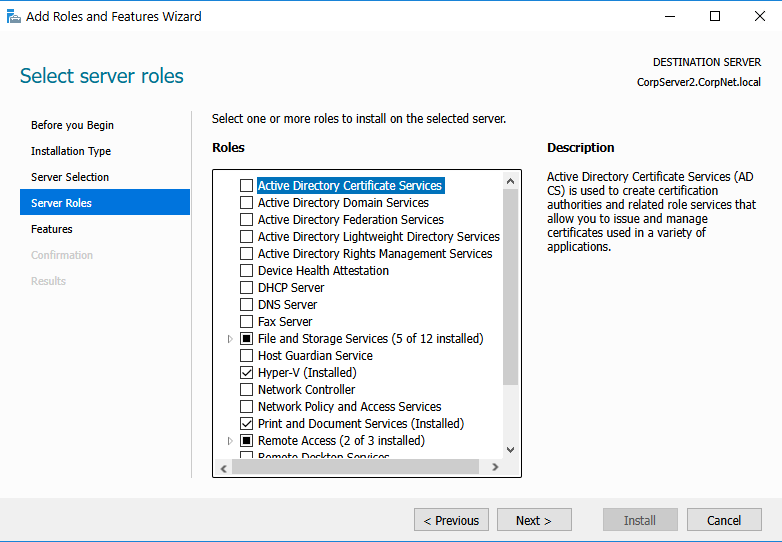

ภาพเหล่านี้แสดงขั้นตอนการกำหนดค่าใน Add Roles and Features Wizard 

ตั้งแต่เริ่มต้นจนถึงการเลือกบทบาทเซิร์ฟเวอร์ สรุปสั้นๆ ดังนี้

1. การเตรียมความพร้อมและตั้งค่าเริ่มต้น (LAB12 - LAB14)

       Before You Begin: หน้าตรวจสอบเงื่อนไขพื้นฐาน เช่น บัญชี Administrator ต้องมีรหัสผ่าน, ตั้งค่า Static IP และอัปเดต Windows เรียบร้อยแล้ว

       Installation Type: เลือกรูปแบบการติดตั้งเป็น Role-based or feature-based installation เพื่อติดตั้งลงบนเครื่องเดียว

       Server Selection: เลือกเซิร์ฟเวอร์เป้าหมายจากรายการ (ในภาพคือ CorpServer2.CorpNet.local)

2. การเลือกบทบาทและคุณสมบัติ (LAB15, LAB7 - LAB11)

       Server Roles: เลือกหน้าที่หลักที่จะติดตั้ง โดยในภาพล่าสุดมีการระบุว่า Hyper-V และ Print and Document Services ถูกติดตั้งไปแล้ว

       Features: เลือกความสามารถเสริม เช่น Group Policy Management ที่ติดตั้งไว้แล้ว

       Remote Access: ตั้งค่าบริการเชื่อมต่อระยะไกล โดยเลือกบริการย่อย DirectAccess and VPN (RAS)

       Web Server (IIS): หน้าอธิบายหน้าที่ของเว็บเซิร์ฟเวอร์เบื้องต้นก่อนไปเลือกบริการย่อย

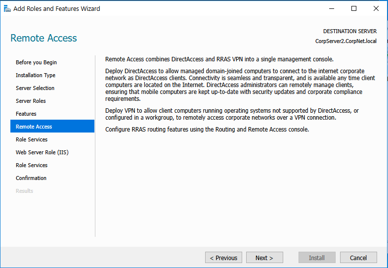

ภาพเหล่านี้แสดงกระบวนการเริ่มต้นและการตั้งค่าใน Add Roles and Features Wizard บน Windows Server 2019 สรุปขั้นตอนสั้นๆ ดังนี้

1. ตรวจสอบและเลือกประเภทการติดตั้ง (LAB12 - LAB13)

       Before You Begin: ตรวจสอบความพร้อมเบื้องต้น เช่น รหัสผ่าน Admin ต้องแข็งแกร่ง และตั้งค่า Static IP เรียบร้อยแล้ว

       Installation Type: เลือก Role-based or feature-based installation เพื่อติดตั้งบริการลงบนเซิร์ฟเวอร์เครื่องเดียว

2. เลือกเซิร์ฟเวอร์และบทบาท (LAB14 - LAB15)

       Server Selection: เลือกเซิร์ฟเวอร์เป้าหมายจาก Server Pool (ในภาพคือ CorpServer2.CorpNet.local)

       Server Roles: เลือกบทบาทที่ต้องการ โดยในภาพมีบทบาทที่ติดตั้งไปแล้ว เช่น Hyper-V และ Print and Document Services

3. รายละเอียดบริการ Remote Access (LAB16)

       Remote Access Intro: หน้าสรุปข้อมูลของบริการเชื่อมต่อระยะไกล ซึ่งประกอบด้วย DirectAccess 

       (เชื่อมต่ออัตโนมัติสำหรับคอมพิวเตอร์ใน Domain) และ VPN (สำหรับคอมพิวเตอร์ทั่วไป)

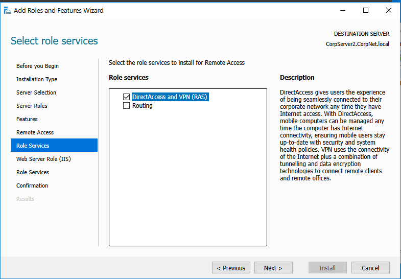

ภาพเหล่านี้แสดงขั้นตอนการกำหนดค่าในหน้าต่าง Select role services 

สำหรับบริการ Remote Access บน Windows Server ครับ สรุปสั้นๆ ดังนี้

1.เลือกบริการย่อย (Role Services): ในหน้าจอนี้เป็นการเลือกฟังก์ชันเฉพาะภายใต้ Remote Access โดยผู้ใช้ได้ติ๊กเลือก "DirectAccess and VPN (RAS)"

2.วัตถุประสงค์: การเลือกส่วนนี้จะช่วยให้เครื่องคอมพิวเตอร์ Client สามารถเชื่อมต่อเข้ากับเครือข่ายภายในขององค์กรผ่านอินเทอร์เน็ตได้ 

3.ไม่ว่าจะผ่านระบบอัตโนมัติ (DirectAccess) หรือการเชื่อมต่อแบบอุโมงค์ปลอดภัย (VPN)

    คำอธิบายเพิ่มเติม: บริการนี้จะช่วยบริหารจัดการนโยบายความปลอดภัยและตรวจสอบสุขภาพของเครื่องที่เชื่อมต่อเข้ามาจากระยะไกลได้ตลอดเวลา

4.ไปต่อ: เมื่อเลือกเสร็จแล้วให้กดปุ่ม Next เพื่อไปตั้งค่าในส่วนของ Web Server (IIS) ต่อไปครับ

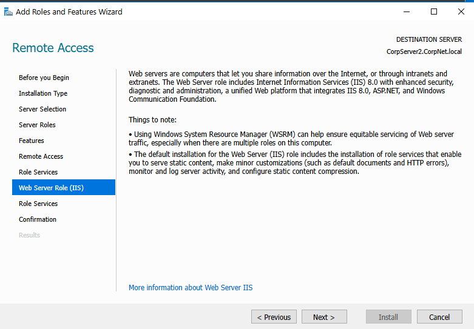

ภาพเหล่านี้แสดงขั้นตอนการกำหนดค่าในหน้าต่าง Web Server Role (IIS) ภายในตัวช่วยติดตั้งของ Windows Server ครับ สรุปสั้นๆ

1.ข้อมูลเบื้องต้นของ IIS: หน้าจอนี้อธิบายว่า Web Server (IIS) 

    คือแพลตฟอร์มสำหรับแชร์ข้อมูลผ่านอินเทอร์เน็ตหรือเครือข่ายภายใน รองรับการทำงานร่วมกับ ASP.NET และมีความปลอดภัยสูง

2.ข้อควรทราบ (Things to note):

    การใช้ Windows System Resource Manager (WSRM) จะช่วยจัดการทรัพยากรให้คุ้มค่าเมื่อมีการรันหลาย Role บนเครื่องเดียว

    การติดตั้งค่าเริ่มต้นจะรวมบริการย่อยที่จำเป็นสำหรับแสดงเนื้อหาเว็บไซต์พื้นฐานและการจัดเก็บ Log ไว้ให้แล้ว

4.ไปต่อ: เมื่ออ่านรายละเอียดและทำความเข้าใจแล้ว ให้กดปุ่ม Next เพื่อเข้าไปเลือกบริการย่อย 
(Role Services) เฉพาะทางของเว็บเซิร์ฟเวอร์ในหน้าถัดไปครับ

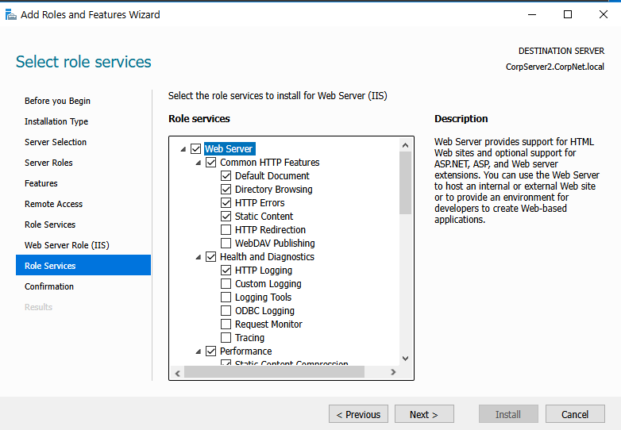

    ภาพนี้คือหน้าต่าง "Select role services" สำหรับการตั้งค่า Web Server (IIS) สรุปขั้นตอนสั้นๆ ดังนี้

    เลือกบริการย่อยของเว็บ (Role Services): เป็นการระบุคุณสมบัติเฉพาะที่ต้องการให้เว็บไซต์ใช้งานได้

    Common HTTP Features: ติ๊กเลือกฟังก์ชันพื้นฐาน เช่น Default Document (หน้าแรกของเว็บ), Directory Browsing 
    (การดูรายชื่อไฟล์), และ Static Content (สำหรับแสดงไฟล์รูปภาพหรือ HTML ปกติ)

    Health and Diagnostics: เลือก HTTP Logging เพื่อให้ระบบบันทึกประวัติการเข้าใช้งานเว็บสำหรับตรวจสอบย้อนหลัง

    วัตถุประสงค์: เพื่อเตรียมสภาพแวดล้อมให้เซิร์ฟเวอร์สามารถรันเว็บไซต์ หรือแอปพลิเคชันอย่าง ASP.NET ได้อย่างสมบูรณ์

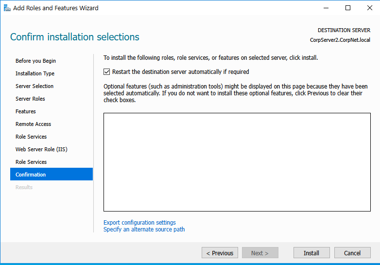

ภาพนี้คือหน้าต่าง "Confirm installation selections" ซึ่งเป็นขั้นตอนสุดท้ายก่อนเริ่มการติดตั้งจริง สรุปได้ดังนี้

    ตรวจสอบความถูกต้อง: เป็นหน้าสำหรับรีวิวรายการ Roles และ Features ทั้งหมดที่คุณเลือกไว้ในขั้นตอนก่อนหน้าเพื่อให้แน่ใจว่าถูกต้อง

    ตั้งค่าการ Restart: มีการติ๊กเลือก "Restart the destination server automatically if required" 
    เพื่ออนุญาตให้ระบบรีสตาร์ทเครื่องเองโดยอัตโนมัติหากจำเป็นหลังจากติดตั้งเสร็จ

    เริ่มการติดตั้ง: เมื่อตรวจสอบทุกอย่างเรียบร้อยแล้ว ให้กดปุ่ม Install เพื่อเริ่มกระบวนการติดตั้งลงบนเซิร์ฟเวอร์ครับ

  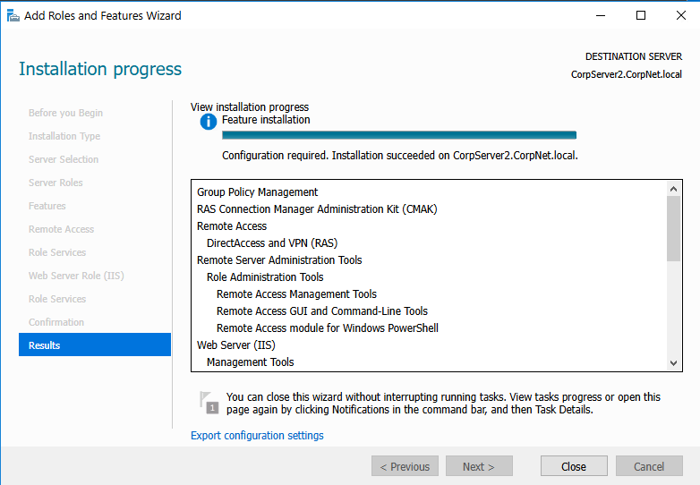

ภาพนี้คือหน้าจอ "Installation progress" ซึ่งเป็นขั้นตอนสุดท้ายที่แสดงผลการติดตั้งครับ สรุปสั้นๆ ดังนี้:

    สถานะการติดตั้ง: แถบสถานะด้านบนแสดงว่าการติดตั้งเสร็จสมบูรณ์แล้ว โดยระบุว่า "Installation succeeded" บนเซิร์ฟเวอร์เป้าหมาย

    สรุปรายการที่ติดตั้ง: ช่องตรงกลางแสดงรายการ Roles และ Features ทั้งหมดที่เพิ่งติดตั้งเสร็จ เช่น Group Policy Management, Remote Access (DirectAccess and VPN) และ Web Server (IIS)

    การดำเนินการต่อ: ระบบแจ้งว่าสามารถปิดหน้าต่างนี้ได้เลย (Close) โดยที่งานการตั้งค่าที่เหลือจะยังคงทำงานอยู่เบื้องหลัง

    ข้อควรระวัง: สังเกตข้อความ "Configuration required" หมายถึงบางบริการ (เช่น Remote Access) อาจต้องมีการเข้าไปตั้งค่าเพิ่มเติม (Post-deployment configuration) ก่อนจึงจะใช้งานได้สมบูรณ์ครับ

  สรุปการทำ LAB Manage Certificates

  1. การเตรียมระบบและเลือกเป้าหมาย

  2. การเลือก Role และ Feature ที่เกี่ยวข้อง

  3. ตรวจสอบและยืนยันการติดตั้ง
