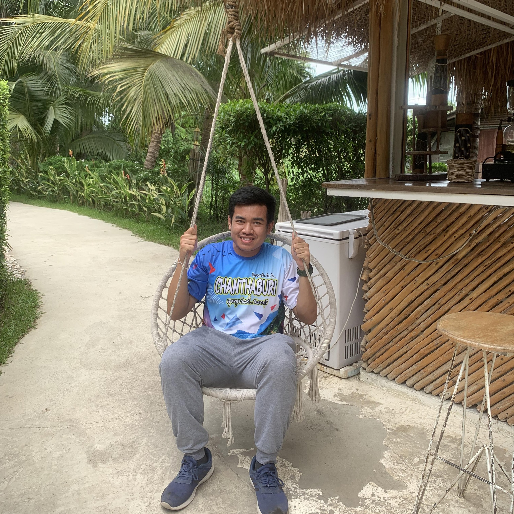

# 👨‍💻 Satakun Kaphon  
**IT Student | Cybersecurity & Networking**

---

## 📘 Vocabulary
> Personal learning notes and technical terms related to IT and Cybersecurity

---

## 🧪 LAB
> Hands-on labs and practical exercises from coursework and self-study

---

## 🎓 Education
- 🎓 **Bachelor of Information Technology (Year 4)**
- 🏫 **Institute of Vocational Education : Central Region 5**

---

## 🏆 Certificates
- 📜 **Cisco Networking Basics**
- 📜 **APNIC Academy – Cybersecurity Fundamentals**
- 📜 **Cybersecurity Fundamentals**  
  👉 [View Certificate](Cybersecurity-Fundamentals)

---

## 📫 Contact
- ✉️ **Email:** Kumkone2546@gmail.com  
- 🌐 **Facebook:** [ศตคุณ กาพล](https://www.facebook.com/st.khun.ka.phl/)

---

❤️ ❤️ ❤️ ❤️ ❤️ ❤️ ❤️ ❤️ ❤️ ❤️
