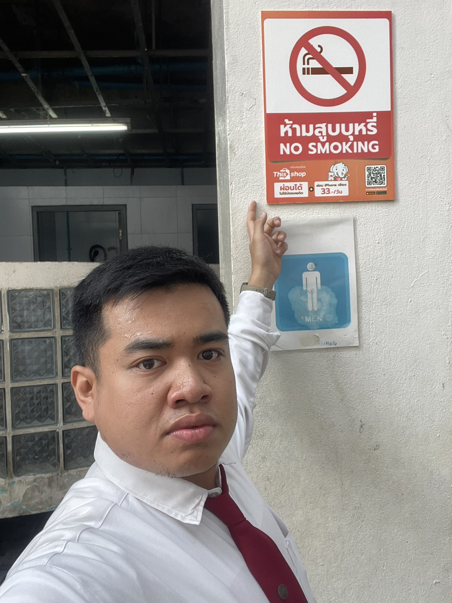

ป้าย “ห้ามสูบบุหรี่ (No Smoking)”

ป้าย “ห้ามสูบบุหรี่ (No Smoking)” ซึ่งมีสัญลักษณ์รูปบุหรี่ถูกขีดทับสีแดง แสดงถึงการ “ห้ามกระทำ” อย่างชัดเจน

ถ้านำไปจัดอยู่ในหัวข้อด้านความปลอดภัย (ตามภาพตาราง Types of Security Controls ที่แนบมา) ป้ายห้ามสูบบุหรี่จัดอยู่ในหัวข้อ: Physical Controls → Preventative Control

(การควบคุมทางกายภาพแบบเชิงป้องกัน)

    เหตุผล:

    เป็นมาตรการที่ใช้ ป้องกันล่วงหน้า (Preventative) ไม่ให้เกิดพฤติกรรมเสี่ยง เช่น การสูบบุหรี่ในพื้นที่ห้ามสูบ

    ช่วยลดความเสี่ยงด้าน อัคคีภัย สุขภาพ และความปลอดภัย

    เป็นการควบคุมที่มองเห็นได้ทางกายภาพ (Physical) เช่น ป้าย สัญลักษณ์ รั้ว ประตู ฯลฯ

