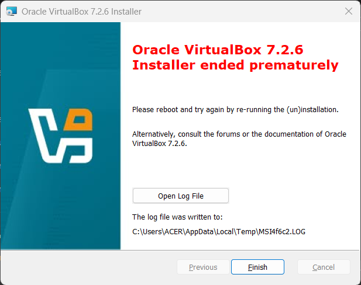
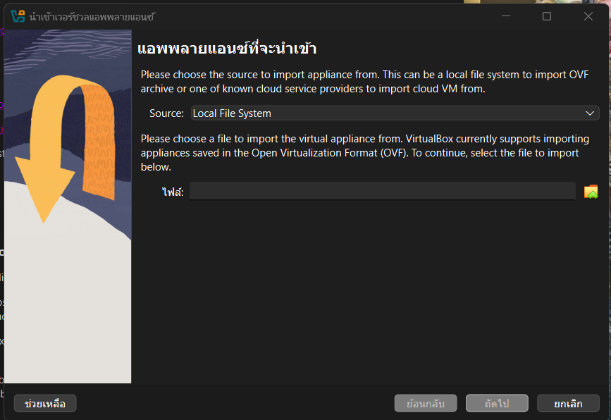
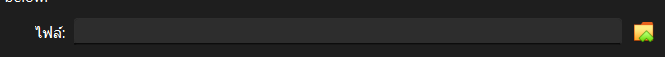
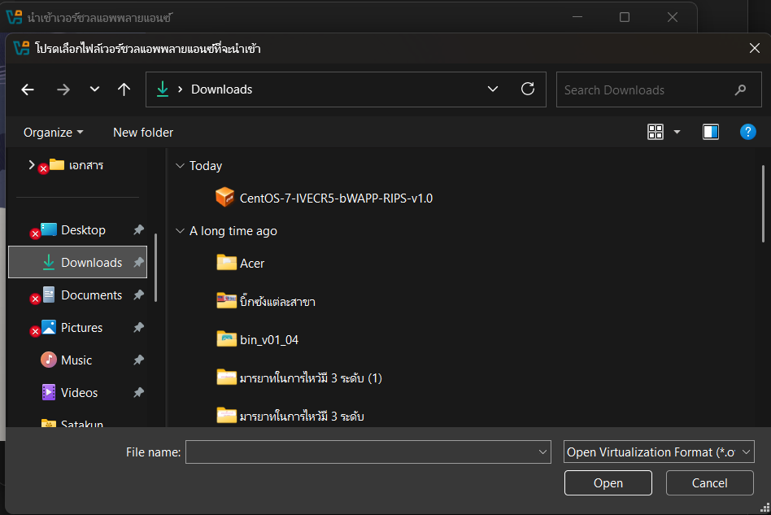
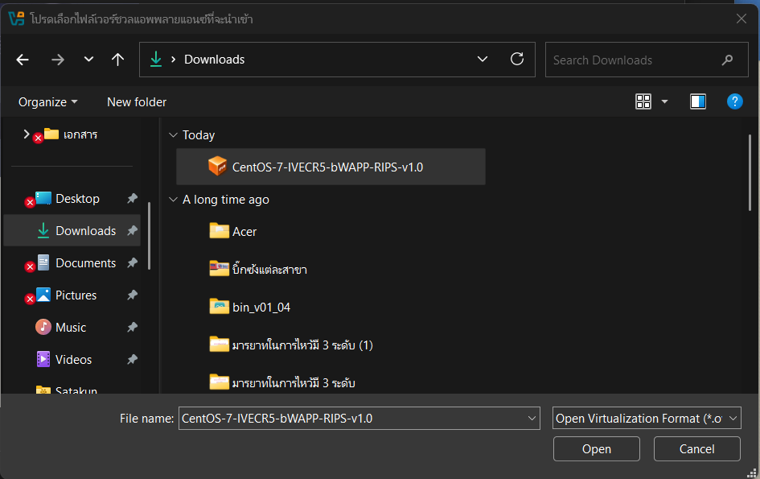
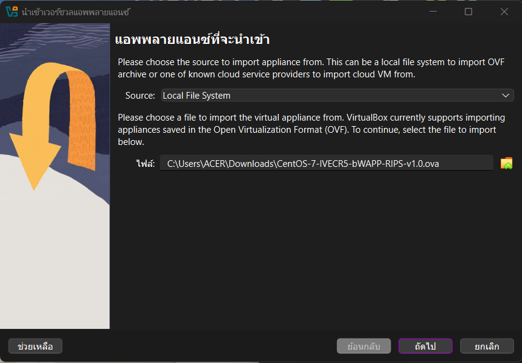
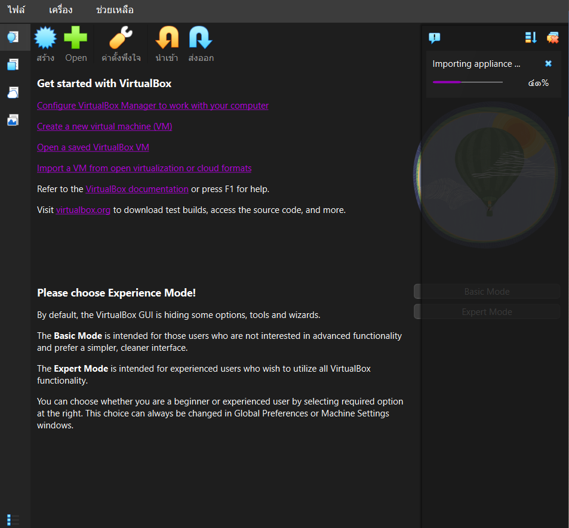
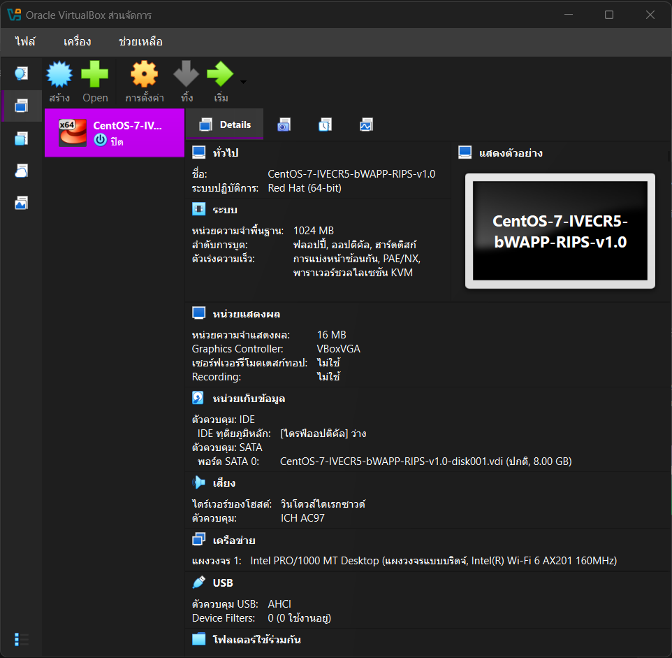

— VirtualBox —

ขั้นตอนที่ 1 ดาวน์โหลดไฟล์ติดตั้ง 

ไปที่เว็บไซต์อย่างเป็นทางการ: virtualbox.org

คลิกที่เมนู Downloads

ภายใต้หัวข้อ “VirtualBox 7.x.x platform packages” ให้คลิกที่ Windows hosts

(แนะนำ) ให้ดาวน์โหลด “VirtualBox 7.x.x Oracle VM VirtualBox Extension Pack” มาเก็บไว้ด้วยครับ (ต้องใช้คู่กันเพื่อให้รองรับ USB 3.0 และฟีเจอร์อื่นๆ)

ขั้นตอนที่ 2: เริ่มการติดตั้ง (Installation)

ดับเบิ้ลคลิก ไฟล์ .exe ที่ดาวน์โหลดมา (เช่น VirtualBox-7.2.6-xxxxx-Win.exe)

หน้าต่าง Setup จะเด้งขึ้นมา ให้กด Next >

พอมาหน้านี้ให้เรากด RePair

จากนั้นกด RePair เช่นกัน

จากนั้นรอทำการติดตั้ง

เมื่อเสร็จแล้ว ให้กด Finish (ถ้าติ๊กถูกไว้ โปรแกรมจะเปิดขึ้นมาเอง)

ขั้นตอนที่ 3: เริ่มการนำเข้า (Import)

เมื่อตั้งค่าทุกอย่างเรียบร้อยแล้ว ให้กดปุ่ม เลือก Import Appliance… (หรือกดคีย์ลัด Ctrl + I)

ในช่อง Source: ตรวจสอบให้แน่ใจว่าเลือกเป็น “Local File System”

คลิกที่ ไอคอนโฟลเดอร์ (ด้านขวาของช่อง File)

หน้าต่างเลือกไฟล์จะเด้งขึ้นมา ให้ไปที่โฟลเดอร์ที่คุณดาวน์โหลดไฟล์ไว้

หน้าต่างเลือกไฟล์จะเด้งขึ้นมา ให้ไปที่โฟลเดอร์ที่คุณดาวน์โหลดไฟล์ไว้

ดับเบิ้ลคลิก ที่ไฟล์ .ova หรือ .ovf ที่ต้องการ (หรือคลิก 1 ครั้งแล้วกด Open)

มื่อตั้งค่าเสร็จแล้ว ให้กดปุ่ม Finish (หรือ Import)

รอหลอดโหลดสีเขียววิ่งจนเต็ม (ความเร็วขึ้นอยู่กับขนาดไฟล์และความเร็วฮาร์ดดิสก์ของคุณ)

เสร็จแล้ว

