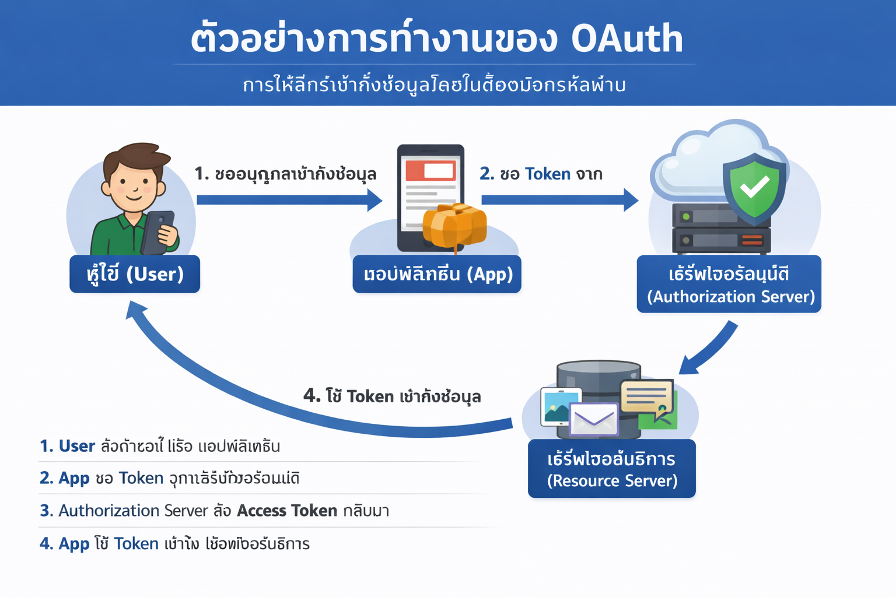

หลักการ authorization

Authorization คือกระบวนการกำหนดสิทธิ์การเข้าถึงทรัพยากรของระบบ โดยจะทำงานหลังจากผู้ใช้ผ่านการ Authentication แล้ว หลักการสำคัญคือการให้สิทธิ์เท่าที่จำเป็น (Least Privilege) การกำหนดสิทธิ์ตามบทบาท (RBAC) และการควบคุมตามนโยบาย เพื่อป้องกันการเข้าถึงข้อมูลหรือการกระทำที่ไม่ได้รับอนุญาต ช่วยเพิ่มความปลอดภัยให้กับระบบสารสนเทศ

## ตัวอย่างการทำงานของ OAuth

1. User ต้องการเข้าสู่แอปพลิเคชัน A จากนั้นแอป A จะขอให้ผู้ใช้เลือกช่องทางที่ต้องการใช้สำหรับ sign-in เข้าสู่ระบบ (เช่น Facebook, Google เป็นต้น)
2. ผู้ใช้เลือกบริการ (เช่น Facebook) แอป A จะนำผู้ใช้ไปยังหน้าเข้าสู่ระบบของ Facebook
3. ผู้ใช้กรอกข้อมูลเข้าสู่ระบบ Facebook จากนั้น Facebook จะถามผู้ใช้ว่า อนุญาตให้ แอป A เข้าถึงข้อมูลอะไรบ้าง (เช่น ชื่อ โปรไฟล์ อีเมล)
4. ผู้ใช้ อนุญาต Facebook จะส่งโทเค็น (Access Token) กลับไปยัง แอป A
5. แอป A ได้รับโทเค็น แอป A จะใช้ token นี้เพื่อติดต่อกับ Facebook เพื่อขอสิทธิเข้าถึงข้อมูลที่ผู้ใช้อนุญาต (authorization)

ข้อดีของ OAuth
ปลอดภัย: ผู้ใช้ไม่ต้องแชร์รหัสผ่านจริงกับแอปพลิเคชันอื่นๆ
สะดวกสบาย: ผู้ใช้เข้าสู่ระบบได้ง่าย ไม่ต้องจำรหัสผ่านหลายอัน
ควบคุมข้อมูล: ผู้ใช้เลือกได้ว่าจะอนุญาตให้แอปพลิเคชันเข้าถึงข้อมูลอะไรบ้าง

## ตัวอย่างการใช้งาน OAuth

เข้าสู่ระบบในเว็บไซต์หรือแอปพลิเคชันต่างๆ ด้วย Facebook, Google, หรือบริการอื่น ๆ เป็นต้น
เชื่อมต่อบัญชีโซเชียลมีเดียกับแอปพลิเคชัน แชร์ข้อมูลได้สะดวก
เชื่อมต่อแอปพลิเคชันต่างๆ เพื่อดึงข้อมูล เช่น แอปพลิเคชันจดบันการออกกำลังกายดึงข้อมูลจากแอปพลิเคชันสุขภาพ
