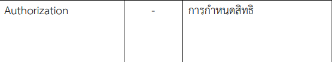

Authorization - คำที่ใช้ในการทำงานที่ผมต้องใช่บ่อย คือ การขออนุญาตต่อหัวหน้างาน 
เวลาออกนอกพื้นที่ทำงานเมื่อหัวหน้างานอนุญาต (Authorization) จึงจะขอออกนอกพื้นที่ได้

หรือบางครั้งต้องขออนุญาตไปรับโทรศัพท์และในบางครั้งมีการประชุมภายในหน่วยก็จะมีการขออนุญาต 
แสดงความคิดเห็นต่างๆคำว่า Authorization เช่น ขออนุญาตไปเข้าห้องน้ำ ไปรับโทรศัพท์ ออกนอกสถานที่ทำงาน จากหัวหน้างาน
ก่อนทุกครั้งจึงจะทำกิจกรรมตามที่ยกตัวอย่างได้

